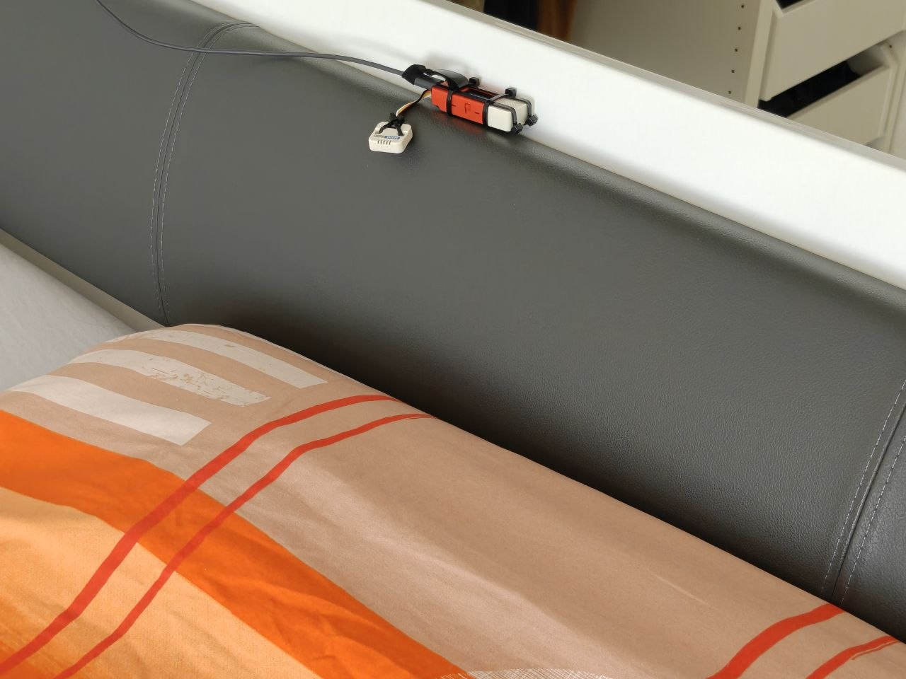
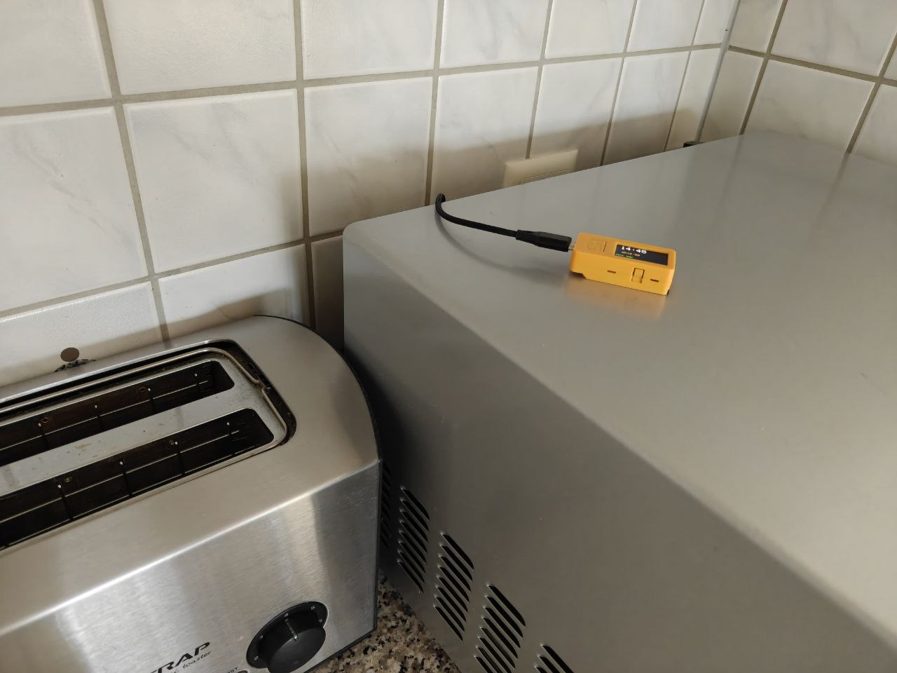
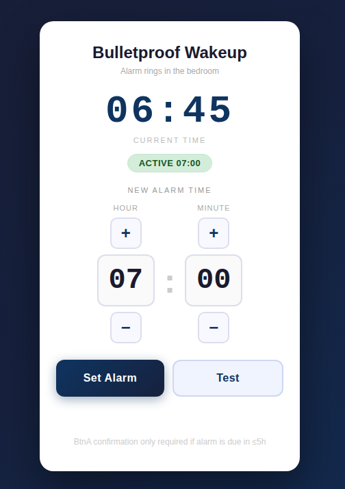

# Bulletproof Wakeup

**An alarm clock you cannot cheat.**

> *"I'll just snooze once."* - everyone, every morning, forever.

Some people have a gift for waking up. This project is not for them.
For the rest of us - the ones who turn off three alarms in their sleep, who have no memory of doing so, who wake up 90 minutes late convinced the alarm never rang - this is the solution.

The alarm rings in the **bedroom**. It can only be stopped in the **kitchen**. By the time you've walked there, you're awake. And just in case you sprint back to bed? It rings again.

---

<div align="center">

| Bedroom | Kitchen |
|:---:|:---:|
|  |  |
| Makes noise. Buttons disabled. | The only way to make it stop. |

</div>

---

## How It Works

Two ESP32 devices communicate over **ESP-NOW** (a WiFi-based peer-to-peer protocol - no router required for the alarm itself).

```
KITCHEN (Master)                    BEDROOM (Slave)
─────────────────────────────────────────────────────
WiFi → NTP time sync
Every 60s: TIME_SYNC ──────────────────────────────▶ RTC updated

At alarm time:
ALARM_START (retried every 5s) ────────────────────▶ 3 sound sources + display blinks
                                ◀──────────────────── ACK

BtnA pressed:
ALARM_STOP ─────────────────────────────────────────▶ Silence

60s later: ALARM_START again ──────────────────────▶ Snooze cycle begins
  (kitchen buzzer joins in too)                       (max 3 cycles: 60s / 60s / 120s)
```

- The **kitchen device** syncs time via NTP, hosts a web UI, and is the sole stop switch
- The **bedroom device** has no WiFi - it only listens for ESP-NOW commands and makes noise
- Bedroom buttons are **disabled in firmware** - there is no local way to stop the alarm

---

## Hardware

| Qty | Part | Link |
|-----|------|------|
| 2× | M5StickC Plus 2 (ESP32, 1.14" display) | [M5Stack Shop](https://shop.m5stack.com/products/m5stickc-plus2-esp32-mini-iot-development-kit) |
| 1× | Speaker HAT for M5StickC (PAM8303, 3W) | [M5Stack Shop](https://shop.m5stack.com/products/m5stickc-speaker-hat) |
| 1× | Passive Buzzer Unit (Grove connector) | [M5Stack Shop](https://shop.m5stack.com/products/passive-buzzer-unit) |

Plus a USB cable and power supply for each device.

---

## Wiring (Bedroom Device)

The bedroom device uses **three simultaneous sound sources** for maximum unavoidability:

| Source | Connection | GPIO |
|--------|-----------|------|
| Internal piezo buzzer | Built-in | GPIO 2 |
| Speaker HAT (PAM8303) | HAT header | GPIO 0 (enable), GPIO 26 (audio) |
| Buzzer Unit | Grove PORT.A cable | GPIO 32 |

The kitchen device needs no extra wiring - just power via USB.

---

## Setup

### 1. Configure

Copy the example config and fill in your values:

```bash
cp shared/user_config.h.example shared/user_config.h
```

Edit `shared/user_config.h`:

```c
#define WIFI_SSID     "your-wifi-network-name"
#define WIFI_PASSWORD "your-wifi-password"
#define KITCHEN_MAC   { 0x00, ... }   // fill in after step 2
#define BEDROOM_MAC   { 0x00, ... }   // fill in after step 2
#define ESPNOW_CHANNEL 6              // fill in after step 2
#define TIMEZONE      "CET-1CEST,M3.5.0,M10.5.0/3"
```

### 2. Flash & get MAC addresses

Flash each device with placeholder MACs (zeros are fine for this step).
Open the Serial Monitor at 115200 baud and read:

```
[KITCHEN] MAC:   AA:BB:CC:DD:EE:FF
[BEDROOM] MAC:   AA:BB:CC:DD:EE:FF
[KITCHEN] Router channel: 6         ← note this for ESPNOW_CHANNEL
```

```bash
cd kitchen && pio run -t upload --upload-port /dev/ttyACM0
cd bedroom && pio run -t upload --upload-port /dev/ttyACM0
```

> If both devices are connected simultaneously, the second one will appear as `/dev/ttyACM1`.

### 3. Fill in MACs, reflash both

Enter the MAC addresses and ESP-NOW channel into `shared/user_config.h`, then flash both devices again.

### 4. Test

```bash
curl -X POST http://alarm.local/test-alarm
```

The bedroom device should ring. Press **BtnA** on the kitchen device to stop it.

---

## Web UI

Access the kitchen device at **`http://alarm.local`** (or by IP address).

<div align="center">

</div>

- Set or change the alarm time
- Trigger a test alarm
- Disable the alarm
- Live status: current time, alarm state, snooze countdown

**API endpoints** (for scripting / home automation):

```bash
# Set alarm
curl -X POST http://alarm.local/request-confirm -d "action=set&hour=7&minute=0"

# Disable alarm
curl -X POST http://alarm.local/request-confirm -d "action=disable"

# Test alarm (no confirmation needed)
curl -X POST http://alarm.local/test-alarm

# Status (JSON)
curl http://alarm.local/status
```

---

## Snooze System

The snooze system is designed to prevent the classic "stopped it and went back to sleep" maneuver:

1. Alarm rings in the **bedroom** → you walk to the kitchen → press **BtnA**
2. **60 seconds later**: alarm rings again - now in *both* bedroom and kitchen
3. Press BtnA again → 60s → rings again
4. Press BtnA a third time → 120s → rings one final time
5. After the 3rd snooze cycle: silence. You win. Go make coffee.

While snooze cycles are running, the **web UI is locked** - you cannot change settings from your phone.

The number of cycles and delays are configurable in `kitchen/src/main.cpp`:
```c
#define SNOOZE_MAX_CYCLES     3
#define SNOOZE_DELAY_SHORT_MS 60000   // 1 min (cycles 1 & 2)
#define SNOOZE_DELAY_LONG_MS  120000  // 2 min (cycle 3)
```

---

## Anti-Tamper

| Attack | Defense | Result |
|--------|---------|--------|
| Press bedroom buttons | Disabled in firmware | No effect |
| Disconnect USB | 200 mAh battery | Keeps running ~30–60 min |
| Firmware crash | Hardware watchdog (10s) | Auto-restart → alarm resumes |
| Reboot | NVS + boot-time check (±10 min) | Alarm fires immediately on boot |
| Change alarm via phone at 2 AM | Physical BtnA confirmation required if alarm is ≤5h away | Half-asleep you cannot disable it remotely |

---

## License

MIT - see [LICENSE](LICENSE).
